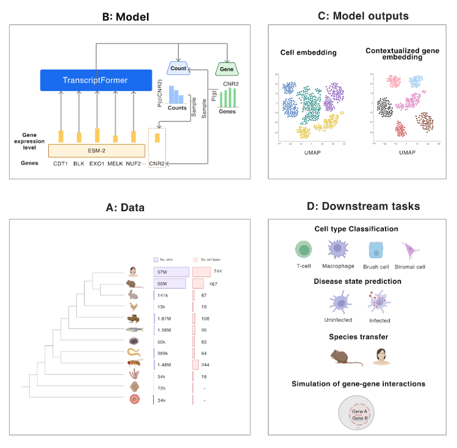

# TranscriptFormer

<p align="center">
  
  <br>
  <em>Overview of TranscriptFormer pretraining data (A), model (B), outputs (C) and downstream tasks (D).
</em>
</p>

**Authors:** James D Pearce, Sara E Simmonds*, Gita Mahmoudabadi*, Lakshmi Krishnan*, Giovanni
Palla, Ana-Maria Istrate, Alexander Tarashansky, Benjamin Nelson, Omar Valenzuela,
Donghui Li, Stephen R Quake, Theofanis Karaletsos (Chan Zuckerberg Initiative)

*Equal contribution

## Description

TranscriptFormer is a family of generative foundation models representing a cross-species generative cell atlas trained on up to 112 million cells spanning 1.53 billion years of evolution across 12 species. The models include three distinct versions:

- **TF-Metazoa**: Trained on 112 million cells spanning all twelve species. The set covers six vertebrates (human, mouse, rabbit, chicken, African clawed frog, zebrafish), four invertebrates (sea urchin, C. elegans, fruit fly, freshwater sponge), plus a fungus (yeast) and a protist (malaria parasite).
The model includes 444 million trainable parameters and 633 million non-trainable
parameters (from frozen pretrained embeddings). Vocabulary size: 247,388.

- **TF-Exemplar**: Trained on 110 million cells from human and four model organisms: mouse (M. musculus), zebrafish (D. rerio), fruit fly (D. melanogaster ), and C. ele-
gans. Total trainable parameters: 542 million; non-trainable: 282 million. Vocabulary size:
110,290.

- **TF-Sapiens**: Trained on 57 million human-only cells. This model has 368 million trainable parameters and 61 million non-trainable parameters. Vocabulary size: 23,829.


TranscriptFormer is designed to learn rich, context-aware representations of single-cell transcriptomes while jointly modeling genes and transcripts using a novel generative architecture. It employs a generative autoregressive joint model over genes and their expression levels per cell across species, with a transformer-based architecture, including a novel coupling between gene and transcript heads, expression-aware multi-head self-attention, causal masking, and a count likelihood to capture transcript-level variability. TranscriptFormer demonstrates robust zero-shot performance for cell type classification across species, disease state identification in human cells, and prediction of cell type specific transcription factors and gene-gene regulatory relationships. This work establishes a powerful framework for integrating and interrogating cellular diversity across species as well as offering a foundation for in-silico experimentation with a generative single-cell atlas model.

For more details, please refer to our manuscript: [A Cross-Species Generative Cell Atlas Across 1.5 Billion Years of Evolution: The TranscriptFormer Single-cell Model](https://www.biorxiv.org/content/10.1101/2025.04.25.650731v1)


## Installation

Transcriptformer requires Python >=3.11.

#### Install from source with uv

```bash
# Clone the repository
git clone https://github.com/czi-ai/transcriptformer.git
cd transcriptformer

# Create and activate a virtual environment with Python 3.11
uv venv --python=3.11
source .venv/bin/activate  # On Windows: .venv\Scripts\activate

# Install in development mode
uv pip install -e .
```

#### Install from PyPI with uv

```bash
# Create and activate a virtual environment
uv venv --python=3.11
source .venv/bin/activate  # On Windows: .venv\Scripts\activate

# Install from PyPI
uv pip install transcriptformer
```

### Requirements

Transcriptformer has the following core dependencies:
- PyTorch (<=2.5.1, as 2.6.0+ may cause pickle errors)
- PyTorch Lightning
- anndata
- scanpy
- numpy
- pandas
- h5py
- hydra-core

See the `pyproject.toml` file for the complete list of dependencies.

### Hardware Requirements
- GPU (A100 40GB recommended) for efficient inference and embedding extraction.
- Can also use a GPU with a lower amount of VRAM (16GB) by setting the inference batch size to 1-4.


## Downloading Model Weights

Model weights and artifacts are available via AWS S3. You can download them using the provided `download_artifacts.py` script:

```bash
# Download a specific model
python download_artifacts.py tf-sapiens
python download_artifacts.py tf-exemplar
python download_artifacts.py tf-metazoa

# Download all models and embeddings
python download_artifacts.py all

# Download only the embedding files
python download_artifacts.py all-embeddings

# Specify a custom checkpoint directory
python download_artifacts.py tf-sapiens --checkpoint-dir /path/to/custom/dir
```

The script will download and extract the following files to the `./checkpoints` directory (or your specified directory):
- `./checkpoints/tf_sapiens/`: Sapiens model weights
- `./checkpoints/tf_exemplar/`: Exemplar model weights
- `./checkpoints/tf_metazoa/`: Metazoa model weights
- `./checkpoints/all_embeddings/`: Embedding files for out-of-distribution species

The script includes progress bars for both download and extraction processes.

## Running Inference

The `inference.py` script provides a convenient interface for running inference with TranscriptFormer. The script uses Hydra for configuration management, allowing flexible parameter specification.

Basic usage:

```bash
python inference.py --config-name=inference_config.yaml model.checkpoint_path=./checkpoints/tf_sapiens
```

#### Key Parameters:

- `model.checkpoint_path`: Path to the checkpoint directory containing model weights and vocabulary files
- `model.inference_config.data_files`: Path(s) to input data files (H5AD format)
- `model.inference_config.pretrained_embedding`: Path(s) to pretrained embeddings (out-of-distribution species)
- `model.inference_config.output_path`: Directory to save inference results
- `model.inference_config.batch_size`: Batch size for inference (default: 32)
- `model.inference_config.precision`: Numerical precision (default: "16-mixed")

#### Example:
For in-distribution species (e.g. human with TF-Sapiens):
```bash
# Inference on in-distribution species
python inference.py --config-name=inference_config.yaml \
  model.checkpoint_path=./checkpoints/tf_sapiens \
  model.inference_config.data_files.0=test/data/human_val.h5ad \
  model.inference_config.batch_size=8
```

For out-of-distribution species (e.g. mouse with TF-Sapiens) supply the embedding file:

```bash
# Inference on out-of-distribution species
python inference.py --config-name=inference_config.yaml \
  model.checkpoint_path=./checkpoints/tf_sapiens \
  model.inference_config.data_files.0=test/data/mouse_val.h5ad \
  model.inference_config.pretrained_embedding=./checkpoints/all_embeddings/mus_musculus_gene.h5
  model.inference_config.batch_size=8
```

To specify multiple input files, use indexed notation:

```bash
python inference.py --config-name=inference_config.yaml \
  model.checkpoint_path=./checkpoints/tf_sapiens \
  model.inference_config.data_files.0=test/data/human_val.h5ad \
  model.inference_config.data_files.1=test/data/mouse_val.h5ad
```

Or use the list notation:

```bash
python inference.py --config-name=inference_config.yaml \
  model.checkpoint_path=../checkpoints/tf_sapiens \
  "model.inference_config.data_files=[test/data/human_val.h5ad,test/data/mouse_val.h5ad]"
```

#### Input Data Format:

Input data files should be in H5AD format (AnnData objects) with the following requirements:

- **Gene IDs**: The `var` dataframe must contain an `ensembl_id` column with Ensembl gene identifiers
  - Out-of-vocabulary gene IDs will be automatically filtered out during processing
  - Only genes present in the model's vocabulary will be used for inference

- **Expression Data**: Raw count data should be stored in the `adata.X` matrix
  - The model expects raw (non-normalized) counts
  - Log-transformed or normalized data may lead to unexpected results

- **Cell Metadata**: Any cell metadata in the `obs` dataframe will be preserved in the output

#### Output Format:

The inference results will be saved to the specified output directory (default: `./inference_results`) in a file named `embeddings.h5ad`. This is an AnnData object where:

- Cell embeddings are stored in `obsm['embeddings']`
- Original cell metadata is preserved in the `obs` dataframe
- Log-likelihood scores (if available) are stored in `uns['llh']`

#### Output:

The inference results will be saved to the specified output directory. The script will generate:

1. Gene embeddings for each cell
2. Log-likelihood scores
3. Metadata from the original dataset

Results are saved in HDF5 format with the same structure as the input data, with additional embedding matrices and likelihood scores.

For detailed configuration options, see the `conf/inference_config.yaml` file.

## Contributing
This project adheres to the Contributor Covenant code of conduct. By participating, you are expected to uphold this code. Please report unacceptable behavior to opensource@chanzuckerberg.com.

## Reporting Security Issues
Please note: If you believe you have found a security issue, please responsibly disclose by contacting us at security@chanzuckerberg.com.

## Citation

If you use TranscriptFormer in your research, please cite:
Pearce, J. D., et. al. (2025). A Cross-Species Generative Cell Atlas Across 1.5 Billion Years of Evolution: The TranscriptFormer Single-cell Model. bioRxiv. Retrieved April 29, 2025, from https://www.biorxiv.org/content/10.1101/2025.04.25.650731v1
